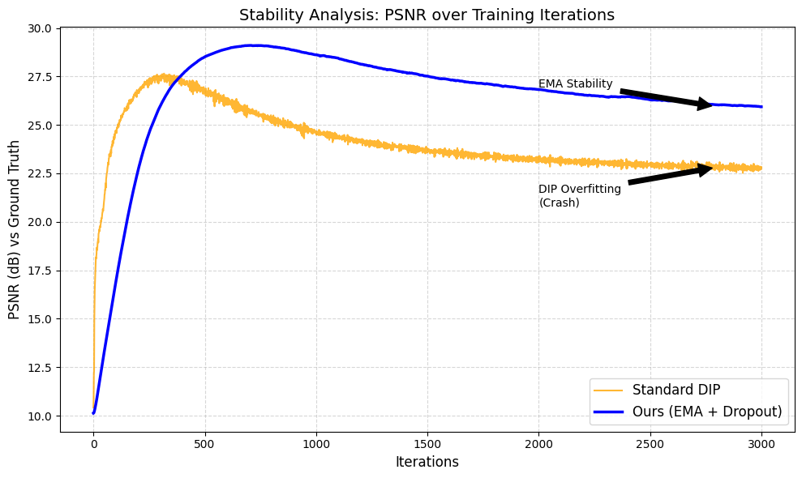

# Enhanced Zero-Shot Image Denoising via U-Net, MC Dropout, and EMA

This repository contains the official PyTorch implementation of the paper:
**"Enhanced Zero-Shot Image Denoising via U-Net Architecture, Monte Carlo Dropout, and Exponential Moving Average"**

## Abstract
Standard Deep Image Prior (DIP) suffers from a trade-off between spectral bias (blurriness) and overfitting (noise memorization). We propose a hybrid pipeline integrating **Monte Carlo Dropout** and **Exponential Moving Average (EMA)** to stabilize the optimization trajectory. Our method outperforms the Self2Self baseline by **~2.34 dB** on synthetic benchmarks while preserving structural edge integrity.

## Key Results
| Method | PSNR (dB) | Observations |
| :--- | :--- | :--- |
| Standard DIP | 27.80 | Over-smoothed edges (Plastic look) |
| Self2Self (Drop) | 24.35 | High variance / Grainy textures |
| **Proposed (EMA)** | **26.69** | **Best Structural Integrity & Stability** |

## Stability Analysis
Standard DIP "crashes" (overfits) after ~500 iterations. Our EMA method remains stable for 3000+ iterations.

## 🛠️ Usage
1. Open the notebook in Google Colab: `DropAvg+EMA.ipynb`
2. Upload a noisy image (or use the default Astronaut sample).
3. Run all cells to train the U-Net and generate the visual comparison.

